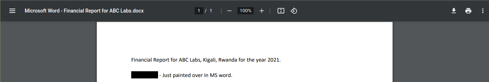
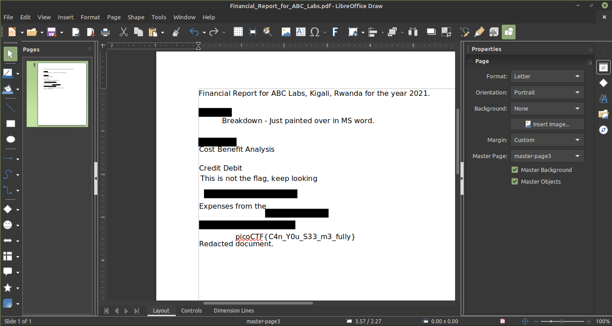

# Redaction gone wrong (100 Pts)

### Description
> Now you DON’T see me. This report has some critical data in it, some of which have been redacted correctly, while some were not. Can you find an important key that was not redacted properly?

We were given a file ending with `.pdf`. Opening it in Google Chrome reveals that the file was a `.docx` file. 

Opening it with any office apps (for me it was LibreOffice Draw), reveals that the "redactions" were nothing but black rectangular shapes put over texts. 

flag: picoCTF{C4n_Y0u_S33_m3_fully}